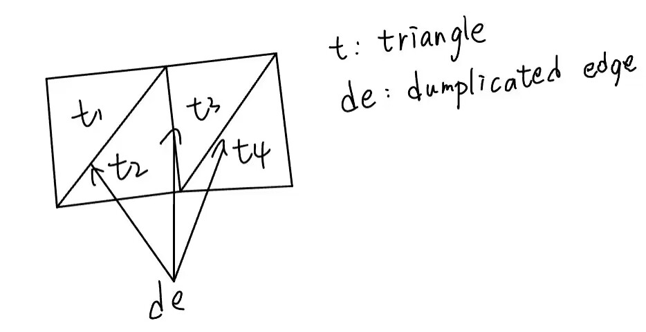

# PBD
Position Based Dynamics with OpenGL.

---
## Description

After cmake and build, you can run PBD.exe. You can see a sphere and dynamic cloth with 2 fixed points.

You can click sphere to pick it and drag it, cloth  will be affected by collsion with sphere.

Noted that you should *项目/删除缓存并重新配置(D)* after you change the content in shader/.

---
## Algorithm

### Construct sphere and cloth

Constructing sphere and cloth is to get vertices(position, index, etc.) for simulation and rendering.

I get vertices of sphere through its uv parameters(in sphere coordination).

And I get vertices of cloth with traversal in X and Z direction.

### Remove duplicated edge
In `Cloth::pbdConstraint()`, we traverse every edge in list of edges to calculate constraint. We get list of edges 
by traverse every triangle in mesh. However, this operation will get duplicated edges like picture below.

So we must remove duplicated edge(using `Cloth::edgeDuplicateRemoval()`). 

- First sort the list of edges according to their indexs using `Cloth::quickSort()`. 
- Second remove duplicated edge by traversing sorted list of edges and retain first dumplicated edge and delete the others.

### Update cloth
Update cloth by updating position and velocity of every vertex on mesh except for two fixed point in `Cloth::update()`.

I only take gravity in consideration for convenience and use delta time between last frame and current frame as `dt` to update velocity.

Subsequently damp velocity and use v*dt to update position of vertex.

After regular simulation, solve PBD constraints and handle collision which will be specified in the following section. 

### Solve PBD constraints
`Cloth::pbdConstraint()` only allows for constraints about length of edges. Refer to formulation in picture below.

More details in my [blog](https://blog.csdn.net/weixin_44491423/article/details/130472994?spm=1001.2014.3001.5502).

### Pick and drag sphere
I use new frame buffer `framebuffer` to help pick and drag sphere in main.cpp. 

- First use `framebuffer` as current frame buffer and draw sphere
in color of red.
- Second draw scene in default frame buffer as usual.
- Third process mouse click in `mouseButtonCallback()`, check if click occurs and if position 
of cursor is on sphere through checking whether color of cursor position is red in `framebuffer`.
- Last update position of sphere according to position of current cursor in `processInput()`.

More details are in picture below. 

### Handle collision
The collision is detected when distance between vertex and center of sphere is less than radius of sphere.

And collision is easily handled by moving vertex to surface of sphere and updating velocity on the basis of displacement of vertex.

---
## Result
